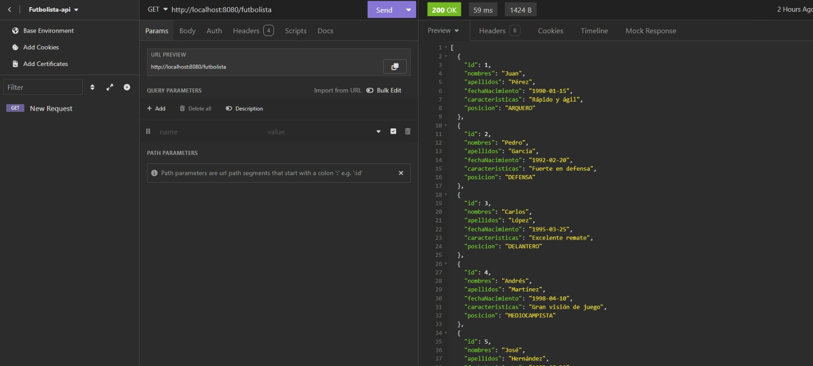
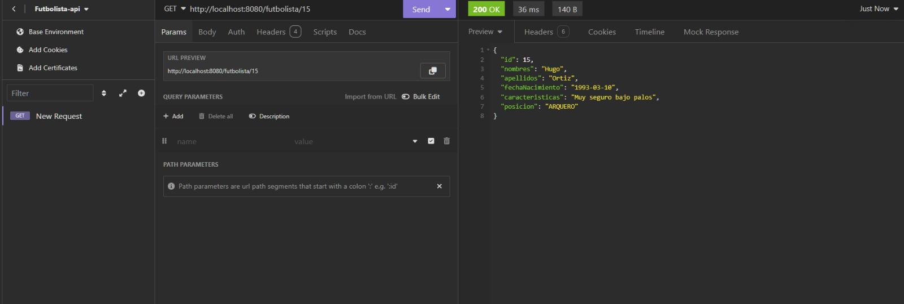

# API de Futbolistas ⚽ 
Este proyecto es una API funcional para gestionar información sobre futbolistas, desarrollada en Java 17 con Spring Boot 3 y utilizando MySQL como base de datos.

## Descripción del Proyecto
La API permite gestionar futbolistas con la siguiente información:

* Id (autogenerado)
* Nombres
* Apellidos
* Fecha de nacimiento
* Características
* Posición (arquero, defensa, mediocampista, etc.)
  
## Endpoints Disponibles
* Obtener la lista de futbolistas: `GET /futbolista`
   * Devuelve la lista completa de futbolistas registrados.
* Obtener la información de un futbolista por ID: `GET /futbolista/{id}`
   * Devuelve la información detallada de un futbolista específico.
     
## Tecnologías Utilizadas

* Java: 17 o superior
* Spring Boot: 3 o superior
* Base de datos: MySQL
  
## Estructura de la Base de Datos

### Tabla Futbolista:
  * id (PK)
  * nombres
  * apellidos
  * fecha_nacimiento
  * caracteristicas
  * posicion_id (FK)
    
### Tabla Posición:
  * id (PK)
  * nombre (arquero, defensa, mediocampista)
    
## Características Opcionales
* Paginación en el endpoint `/futbolista` para manejar grandes volúmenes de datos.
  
### Instalación y Configuración

1. Clonar el repositorio:
  ```sh
  git clone https://github.com/tu_usuario/tu_repositorio.git
  ```
  
2. Navegar al directorio del proyecto:
  ```sh
  cd tu_repositorio
  ```
3. Configurar la base de datos:
  * Asegúrate de tener MySQL instalado y ejecutando. Luego, crea una base de datos y configura los detalles de conexión en **src/main/resources/application.properties**.

4. Iniciar la aplicación:
    ```sh
    ./mvnw spring-boot:run
    ```
### Uso

## Ejemplos de Solicitudes

* Obtener la lista de futbolistas:
   ```sh
  url -X GET http://localhost:8080/futbolista
  ```
   
  
* Obtener un futbolista por ID:
   ```sh
  url -X GET http://localhost:8080/futbolista/{id}
   ```
  


 ### Contribuciones
Este proyecto está abierto a contribuciones 😊. Si deseas colaborar:

1. Fork el repositorio
2. Crea una nueva rama para tu característica o corrección:
   
  ```sh
  git checkout -b nombre-de-la-rama
  ```
3. Realiza tus cambios y confirma:
   
  ```sh
  git commit -am 'Añadir nueva característica'
  ```
4. Sube tus cambios a tu repositorio:
   
  ```sh
  git push origin nombre-de-la-rama
  ```
5. Abre un Pull Request
